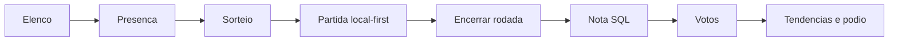
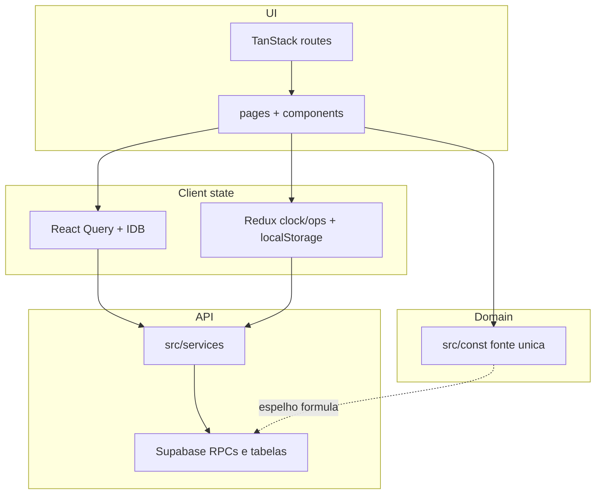
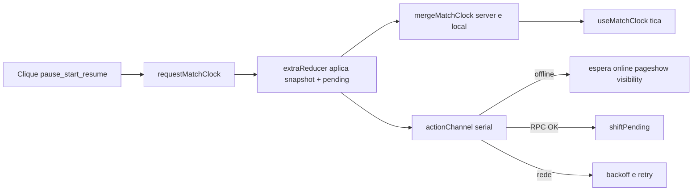
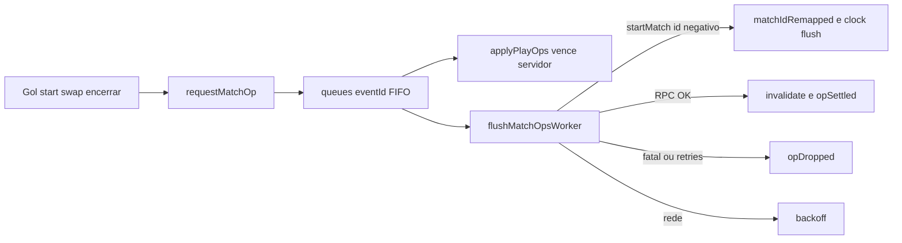
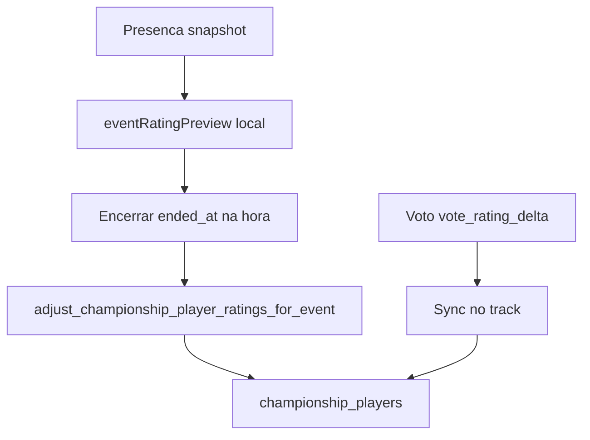
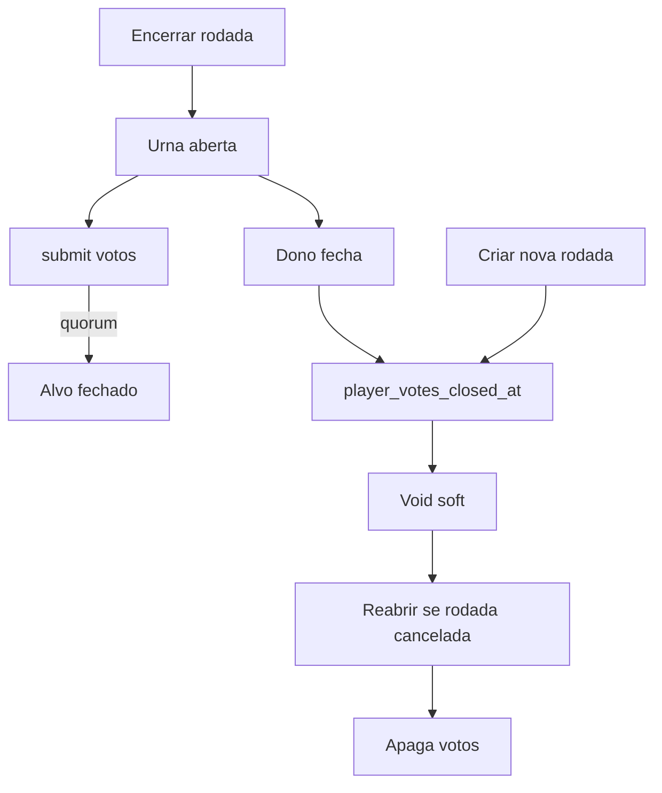
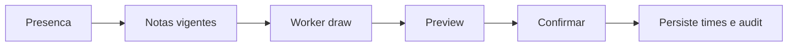

# Baba do Mago

PWA para pelada amadora: elenco, presença, sorteio por nota, partida ao vivo (local-first), nota pós-rodada, votos, pódio e tendências.

Tira o caos de WhatsApp + times no olho + placar na memória. No campo o celular passa de mão em mão — gol, troca e encerrar precisam funcionar offline ou com rede ruim.

Documento único para compartilhar (produto, arquitetura, fórmulas, filas, gráficos e motivos).

## Índice

1. [Ciclo do produto](#ciclo-do-produto)
2. [Stack](#stack)
3. [Setup](#setup)
4. [Auth Google](#auth-google-teste-local)
5. [Banco e rotas](#banco-migrations)
6. [Abas do campeonato](#abas-do-campeonato)
7. [Arquitetura](#arquitetura)
8. [Filas de partida](#filas-de-partida-clock--ops)
9. [Nota (rating)](#nota-rating-do-jogador)
    - [Fórmula](#fórmula-já-ranqueado)
    - [Evolução pós-rodada](#evolução-pós-rodada)
    - [Evolução da nota: métrica, histórico e recompute](#evolução-da-nota-métrica-histórico-e-recompute)
10. [Voto do elenco](#voto-do-elenco)
11. [Sorteio](#sorteio-de-times)
12. [Nota oculta](#nota-oculta-hidden-strength)
13. [Gráficos e métricas](#gráficos-e-métricas-da-ui)
    - [Recortes e filtros](#recortes-e-filtros)
    - [Tendências](#tendências)
    - [Pódio](#pódio)
    - [Classificação](#classificação)
    - [Projeções](#projeções-só-dono)
    - [Ficha do jogador](#ficha-do-jogador)
    - [Gestão](#gestão)
    - [Receitas rápidas](#receitas-rápidas)

---

## Ciclo do produto



## Stack

| Camada | Escolha |
| --- | --- |
| App | React 19, TypeScript, Vite 7 |
| Rotas | TanStack Router |
| Server state | TanStack Query + persist IDB |
| Filas locais | Redux Toolkit + redux-saga + redux-persist |
| Backend | Supabase (Postgres, Auth Google, Realtime, Storage) |
| UI | Tailwind 4, Motion, Recharts |
| Package | **yarn** |
| Deploy | Vercel (SPA) + PWA |

**Princípio:** UI pinta na hora; fila só sincroniza.

## Setup

```bash
yarn
cp .env.example .env
yarn dev
```

Preencha no `.env`:

- `VITE_SUPABASE_URL`
- `VITE_SUPABASE_PUBLISHABLE_KEY`
- `VITE_MATCH_CLOCK_DEBUG` (opcional; filas em produção)

Não coloque `client_secret` do Google no front nem no `.env`. Client ID e Secret vão só no [Google provider do Dashboard](https://supabase.com/dashboard/project/sgbznwbgxrzrasrrvnuy/auth/providers?provider=Google).

Scripts: `yarn lint`, `yarn typecheck`, `yarn db:types` (gera `src/types/database.types.ts`).

## Auth Google (teste local)

Google Cloud → OAuth Web client:

- Authorized JavaScript origins: `http://localhost:5173` (com porta)
- Authorized redirect URIs: `https://sgbznwbgxrzrasrrvnuy.supabase.co/auth/v1/callback`

Supabase → Authentication → URL Configuration:

- Site URL: `http://localhost:5173`
- Redirect URLs: `http://localhost:5173/**`

## Banco (migrations)

Schema e RPCs em [`supabase/migrations/`](supabase/migrations/), ordem cronológica do timestamp no nome. Ambiente novo: aplicar **todas**. Conjunto atual passa de 100 arquivos. Types: `yarn db:types`.

## Rotas principais

| Rota | Uso |
| --- | --- |
| `/` | Campeonatos que você criou ou entrou |
| `/championships/new` | Criar (entra como jogador) |
| `/championships/:id` | Detalhe / abas |
| `/championships/:id/events/:eventId` | Rodada |
| `/championships/:id/events/:eventId/play` | Partida ao vivo |
| `/join/:codigo` | Convite público |

## Abas do campeonato

| Aba | Uso |
| --- | --- |
| Elenco | Jogadores, papéis, estrelas |
| Rodadas | Presença, sorteio, partida, encerrar |
| Classificação | Tabela agregada no cliente |
| Pódio | Rankings do período + share |
| Tendências | Forma, contribuição, mapa, inflação, saúde, gols, heatmap… |
| Simular Sorteio | Prévia sem gravar |
| Projeções | Calibração / gap (dono) |
| Mensalistas | Quem é mensalista |
| Gestão | Config, votos void, auditoria |

Labels: `src/const/championship-tab.ts`.

---

## Arquitetura

### Camadas



| Camada | Papel |
| --- | --- |
| `src/pages` + `src/components` | Telas e UI |
| `src/const` | Fonte única de regras, labels PT, overlays, query keys |
| `src/hooks` | React Query + hooks de UI (clock, online, PWA) |
| `src/services` | Clientes finos Supabase |
| `src/store` | Só filas offline de partida (clock + ops) |
| `src/lib` | Query client, sorteio, share, auth guards |
| `src/workers` | Workers de sorteio equilibrado e potes |
| `supabase/migrations` | Schema, RPCs, RLS |

### Bootstrap

Ordem em `src/main.tsx`: Redux `Provider` → `PersistGate` → `AppQueryClientProvider` → Router.

### Estado

**React Query (servidor):** cache de campeonatos/elenco/rodadas/votos; IDB `baba-query-cache`; `networkMode: "offlineFirst"`; keys em `src/const/championships-query-key.ts`. Não escrever overlay de partida/nota no cache.

**Redux + Saga (filas):**

| Slice | Persist key | Whitelist |
| --- | --- | --- |
| `match-clock` | `babaDoMago-match-clock` | `clocks`, `deferredClear` |
| `match-ops` | `babaDoMago-match-ops-event` | `queues`, `seq`, `localMatchMap` |

Offline: `online` / `pageshow` / `visibility` (`online-channel.ts`).

**Context:** Auth Google, Theme. **Draft presença:** `baba-event-attendance-draft:{eventId}`.

### Pastas `src/`

| Pasta | Conteúdo |
| --- | --- |
| `routes/` | File-based TanStack Router |
| `pages/` | Páginas por rota |
| `components/` | Feature + atoms / molecules / organisms |
| `const/` | Domínio + `*.check.ts` |
| `store/match-clock` · `match-ops` | Slice, saga, flush-worker |
| `hooks/championships/` | Queries tipadas |
| `services/` | RPCs Supabase |
| `workers/` | Draw workers |
| `types/` | Inclui `database.types.ts` gerado |

### i18n e checks

Sem i18n lib — pt-BR via `*_LABEL` em `src/const/`. Checks `*.check.ts` ao lado da regra (asserts sem framework).

### Hierarquia de dados

```text
users → championships → championship_players
                      → championship_events
                          → attendance / rsvp / teams / matches / goals / votes
```

---

## Filas de partida (clock + ops)

Partida **local-first**: pause, gol, encerrar pintam na hora. Saga só sincroniza. Offline não apaga a fila.

Código: `src/const/championship-event-match.ts`, `championship-event-match-ops.ts`, `src/store/match-clock/`, `src/store/match-ops/`.

**Motivo:** no campo a rede falha; esperar RPC antes de pintar quebra o fluxo. Overlay local vence o servidor enquanto houver fila.

### Relógio (`match-clock`)



1. Clique → `requestMatchClock` → muda `started_at` / `paused_at` / `pause_accumulated_seconds` + empilha `pending`.
2. Display: `mergeMatchClock(server, local)`. Local vence com `hasMatchClockLocal`.
3. Tick só no snapshot mesclado; flush/offline/retry **não** param o tick.
4. Saga serial; offline espera rede sem tirar da fila.
5. `clearMatchClock` com `pending` → `deferredClear` até drain.
6. Ação inválida = no-op (pause duas vezes).

### Ops (`match-ops`)



Kinds: jogador, goleiro, gol, desfazer, abrir, editar time, trocar time, encerrar, descartar, presença, encerrar rodada.

1. Empilha em `queues[eventId]`; overlay vence refetch/realtime.
2. `startMatch` com `localId` negativo → remap + flush do clock.
3. Relógio não chama RPC com `matchId < 0`.
4. Fatal / retries esgotados → `opDropped`; rede → backoff.
5. Desfazer gol local cancela `addGoal` se ainda não `inFlightId`.
6. Encerrar/próxima/descarte no fim da fila; UI não espera.
7. Presença **antes** de `startMatch`; `endEvent` por último; nota final só no SQL.

### O que não fazer (filas)

- Não meter flush em `busy` / não `await` flush antes de pintar.
- Não trocar display pelo servidor enquanto houver snapshot local.
- Não limpar store com `pending` (usar `deferredClear`).
- Não escrever overlay no React Query.
- Não chamar RPC de relógio com id negativo.

Debug: botão da fila no `yarn dev`; produção `VITE_MATCH_CLOCK_DEBUG=true`.

---

## Nota (rating) do jogador

A nota **não é Elo**. Não depende de gols, adversário nem K-factor. Muda pelo **aproveitamento de pontos** da rodada.

### Motivação

1. Equilibrar times no sorteio de forma previsível.
2. Ignorar destaque individual (gol/assist) na força do time.
3. Empate justo: empates > derrotas → empate vale 1,5.
4. Escalar com o teto da liga (`max(maior nota, 5)`, até 100).

Duas métricas: `rating` (linha) e `goalkeeper_rating` (goleiro). Mesma fórmula TS + SQL.

### Conceitos

| Conceito | Significado |
| --- | --- |
| `rating` / `goalkeeper_rating` | Notas de linha e goleiro |
| Track vigente | `attendance.is_goalkeeper` escolhe qual nota ajusta |
| `0` (sentinela) | Sem nota oficial; no sorteio vira média dos presentes com nota |
| Teto / piso | ceiling da rodada; piso `0.1` (sentinela fica `0`) |
| MVP | `2%` da nota snapshot, ceil 1 casa, mín. `+0.1` |

Pontos: V=3, E=1 (ou **1,5** se E>D), D=0.

### Quando a nota não muda

- `matches < championships.rating_min_matches` (default **3**, faixa 3–10 na Configuração do baba)
- Já ranqueado com aproveitamento na **zona morta** 45%–55% (MVP ainda pode somar)
- Se **qualquer** time da rodada tem aproveitamento de classificação ≥ **80%** (≥ `rating_min_matches` jogos), a zona morta vira **35%–55%** para todos. Abaixo de 35% o delta continua normal. Empate do time = 1 pt (como na classificação).

### Fórmula (já ranqueado)

```text
drawPoints = draws > losses ? 1.5 : 1
points     = 3 * wins + drawPoints * draws
rate       = points / (3 * matches)
delta      = round((rate - 0.5) * ceiling / 2, 1)
notaNova   = clamp(notaAtual + delta, 0.1 … 100)
```

### Nota inicial (sentinela `0`)

Primeira rodada com `rating_min_matches`+ jogos: semente **depois** delta ranqueado.

| Aproveitamento | Semente |
| --- | --- |
| < 45% | 2.7 |
| 45%–55% | 3 |
| > 55% | 3.5 |

Exceção: snapshot `0` + nota manual no elenco + `rating_delta = 0` → não reseeda.

### MVP

```text
bonus = max(0.1, ceil(rating * 0.02 * 10) / 10)
```

Até 3 MVPs/rodada. Sentinela ainda ganha `+0.1`.

### Exemplos (teto 5)

| Cenário | V/E/D/J | rate | Delta | De → Para |
| --- | --- | --- | --- | --- |
| Bom | 4/0/2/6 | 66,7% | +0,4 | 4 → **4,4** |
| Ruim | 1/0/2/3 | 33,3% | −0,4 | 3,5 → **3,1** |
| Zona morta | 2/0/2/4 | 50% | 0 | 4 → **4** |
| < piso jogos | 1/0/0/1 | — | 0 | 4 → **4** |
| 3 empates (1,5) | 0/3/0/3 | 50% | 0 | 4 → **4** |
| Empates = derrotas | 0/2/2/4 | 16,7% | −0,8 | 4 → **3,2** |
| Semente boa | 4/0/2/6 | 66,7% | semente 3,5 +0,4 | 0 → **3,9** |

Mesmo rate, teto alto move mais (ex.: 66,7% com teto 75 → +6,3).

### Evolução pós-rodada



Nota do elenco **só no SQL**. Cliente não grava `championship_players.rating` no encerrar.

| Camada | Em `eventRatingDelta`? | Campo |
| --- | --- | --- |
| Aproveitamento / semente | sim | `rating_delta` |
| MVP | soma em cima | `rating_delta` |
| Amortecimento queda (flag) | só se delta &lt; 0 | `rating_delta` |
| Voto ±0,5 | não | `vote_rating_delta` |

### Amortecimento de queda (flag)

`rating_drop_goal_share` (default off). Só delta negativo; share G+A no próprio time **> 40%** → `delta *= (1 − share)`. `rating_drop_share_exclude_top`: top 10 da liga não entram. Gol **não** sobe nota.

### Evolução da nota (métrica, histórico e recompute)

Três coisas com nome parecido, contas diferentes. Confundir isso gera discussão no grupo.

| Nome na UI | O que é | Conta |
| --- | --- | --- |
| `Rating` / estrela | Nota atual no elenco | `championship_players.rating` |
| **Evolução da nota** (coluna `Evol.` / métrica do pódio) | Quanto a nota **variou** no período | `nota final − nota inicial` do período |
| **Evolução da nota** (gráfico de linha) | Série da nota rodada a rodada | `ratingTo` de cada presença |
| **Δ nota** (Forma recente) | Soma dos deltas da janela | `Σ rating_delta` |
| **Delta** (histórico da ficha) | Delta daquela rodada | `attendance.rating_delta` |

#### Campos que alimentam tudo

Na presença (`championship_event_attendance`):

| Campo | Significado |
| --- | --- |
| `rating` | **Snapshot**: nota que o jogador tinha **antes** da rodada |
| `rating_delta` | Delta aplicado pela fórmula (aproveitamento/semente + MVP + amortecimento) |
| `goalkeeper_rating_delta` | Mesmo papel, no track de goleiro |
| `vote_rating_delta` | Overlay do voto (±0,5), **fora** da fórmula |
| `vote_rating_applied` | Evita aplicar o voto duas vezes |

#### Nota depois da rodada

```text
attendanceRatingAfter(row) = apply(row.rating, row.rating_delta + row.vote_rating_delta)
attendanceRatingEvolution(row) = round1(after − row.rating)
```

`apply` faz o clamp (`0,1 … 100`) e mantém a sentinela `0` quando o resultado não passa de 0. `round1` arredonda 1 casa **para longe do zero** (`+1.25 → +1.3`, `−1.25 → −1.3`). Formato na tela: `+1.2`, `−0.5`, `0`.

#### Métrica do pódio (variação no período)

```text
from = rating (snapshot) da PRIMEIRA rodada do período
to   = ratingAfter da ÚLTIMA rodada do período
evolução = round1(to − from)
```

- “Primeira” e “última” ordenam por `starts_at` e desempatam por `id`.
- Se o período **inclui hoje** (temporada corrente, mês atual…), `to` passa a ser a **nota viva do elenco** (`player.rating`). Assim edição manual de estrela e voto já aplicado aparecem na evolução do mês.
- Só entra quem tem presença no período. Valor `0` não sobe ao pódio.
- Fonte: `podiumRatingEvolution`, `aggregatePodiumPlayersFromEvents` em `src/const/podium.ts`.

#### Gráfico de evolução (campeonato)

`championshipRatingHistoryChart(players, events, nowIso)`:

1. Eixo X = rodadas encerradas em ordem cronológica.
2. Valor por rodada = `ratingTo` da presença (`snapshot + rating_delta`).
3. Rodada sem presença **carrega o último valor** — linha reta, não buraco.
4. Antes da primeira nota oficial o valor é `null`: a linha só começa quando existe nota.
5. Quando o jogador já entrou com nota, o gráfico insere um **ponto de entrada** antes da primeira rodada dele.
6. Com `nowIso`, o último ponto é a **nota atual do elenco** — a linha fecha no valor real de hoje.
7. Sentinela `0` não vira ponto. Sem nenhum valor oficial a série sai do gráfico (“Ainda sem nota”).
8. Eixo Y vai de `0` ao **teto da liga**. Cor é fixa por id do jogador (paleta de 12).

O mesmo motor serve às outras métricas do pódio:

| Tipo | Métricas | Comportamento |
| --- | --- | --- |
| Nota | Rating | valor por rodada, com carry-forward |
| Contagem acumulada | Gols, Assistências, Gols servidos, Gols contra, Participação em gols, Vitórias, MVP, Jogos | soma acumulada ao longo das rodadas |
| Razão acumulada | Média de gols, Média de assistências, WinRate | razão do acumulado (Y do WinRate travado em 0–1) |
| Sem série | Evolução da nota, Gols da virada, Assistências da virada | por design: são deltas/derivados, não acumulam |

**Corrida da nota** exporta esse gráfico como GIF ou vídeo, com limite `Melhores` / `Piores` (3, 5, 10, 15, 20) ou `Todos`.

Fontes: `championship-rating-history.ts`, `championship-count-history.ts`, `championship-ratio-history.ts`, `championship-metric-history.ts`, `rating-race-share.ts`.

#### Histórico na ficha do jogador

`playerProfileHistory(events, playerId)` devolve uma linha por rodada encerrada em que ele teve presença, da **mais recente** para a mais antiga:

```text
ratingFrom = attendance.rating          (snapshot)
ratingDelta = attendance.rating_delta
ratingTo    = apply(ratingFrom, ratingDelta)
```

Colunas: Data, `G`, `A`, `GS`, `GC`, `V`, `D`, `E`, `MVP`, `J` e `Δ`.

O gráfico da ficha desenha: `ratingFrom` da rodada mais antiga → `ratingTo` de cada rodada → **nota atual** como último ponto.

**Atenção à diferença de conta:** ficha e gráfico do campeonato usam só `rating_delta`. Pódio e inflação usam `rating_delta + vote_rating_delta`. Quando um voto fecha com ±0,5, o último ponto (nota atual) “corrige” o degrau que a soma dos deltas não mostra.

#### Inflação da nota

Reconstrói a liga rodada a rodada: para cada presença aplica `rating_delta + vote_rating_delta` e guarda a nota resultante por jogador; depois calcula **média dos presentes ranqueados**, **teto** e **piso** do elenco no escopo. Sentinela `0` fica fora da média. Fonte: `championship-rating-inflation.ts`.

#### Persistência e recompute

- Nota do elenco **só muda no SQL**, no encerrar da rodada: `adjust_championship_player_ratings_for_event` grava `rating_delta` (ou `goalkeeper_rating_delta`) e depois sincroniza voto pendente.
- Corrigir estatística de uma rodada já encerrada **não** recalcula em cima da nota atual:

```text
nova nota = apply(rating, −old_delta + eventRatingDelta(V, E, D, J, snapshot, teto))
```

  A fórmula usa o **snapshot da presença**, não a nota de hoje (`recomputePlayerEventRating`, `playerEventRatingAfterSave`).
- Recálculo em massa: [`supabase/scripts/recompute_ratings_from_attendance.sql`](supabase/scripts/recompute_ratings_from_attendance.sql).

#### Onde a evolução aparece

| Tela | O que mostra |
| --- | --- |
| Elenco | coluna `Evol.` (variação) |
| Pódio | métrica **Evolução da nota** + gráfico da métrica escolhida |
| Tendências | `Δ nota` na Forma recente, Evolução da nota do recorte, Inflação |
| Ficha do jogador | histórico com `Δ`, gráfico pessoal, Projeção × realizado, aba Simulação |
| Rodada | prévia da nota antes de encerrar (`eventRatingPreview`) |

#### Pegadinhas

- Δ da janela (Tendências) ≠ evolução do período (Pódio) ≠ nota atual: recortes e contas diferentes.
- Edição manual de estrela aparece na **evolução do período corrente** (compara início e nota viva), mas não na soma de deltas.
- Primeira rodada válida de quem estava com `0` mostra salto grande: é a **semente** (2,7 / 3 / 3,5) mais o delta.
- Track de goleiro evolui separado; o gráfico histórico de goleiro ainda não existe.
- Rodada cancelada / voto anulado (`void`) devolvem a nota, mas os deltas gravados continuam na presença.

### Código da nota

| Camada | Onde |
| --- | --- |
| TS | `src/const/event-rating-adjustment.ts` |
| Checks | `event-rating-adjustment.check.ts` |
| SQL | `championship_event_rating_delta`, `adjust_championship_player_ratings_for_event` |
| Simulador ficha | `?tab=sim` — não grava |

**SQL e TS iguais.** Não inventar Elo, K-factor, ajuste por adversário ou gols na fórmula base.

---

## Voto do elenco

Overlay ±0,5 **depois** da rodada. Não entra em `eventRatingDelta`. Urna secreta; dono vê totais. Código: `src/const/event-player-vote.ts`.

**Motivo:** fórmula é cega a “foi decisivo”; elenco ajusta fino sem virar Elo social.

**Quem vota:** dono/capitão/admin presentes, ou mensalista (mesmo ausente). Flag `player_vote_allow_self`. Só com `ended_at`.

| Item | Valor |
| --- | --- |
| Quórum | `player_vote_quorum` (default 3, 1–10) |
| Orçamento | 5 likes + 5 dislikes; manter/nulo ilimitados |
| Like / dislike | N+ e supera o outro polo **e** maintains → ±0,5 e fecha |
| Manter | bloqueia ±0,5 se não superado |
| Nulo (`blank`) | grava urna; fora da fórmula |
| Totais | só dono |



Encerrar rodada ≠ encerrar votação. Void soft: notas voltam, votos ficam. Reabrir apaga votos (não reativa efeito antigo). Sentinela guarda overlay até semente.

RPCs: `submit_…`, `list_…_vote_counts`, `close_…`, `void_…`, `reopen_…`.

---

## Sorteio de times

Roda no **cliente** (worker). Banco só persiste resultado + auditoria.

**Motivo:** times no olho viram briga; worker não trava a UI.

| Modo | O que faz | Quando |
| --- | --- | --- |
| Equilibrado | Minimiza spread de rating | Fluxo principal |
| Potes | Cabeças + potes | Paralelo; não substitui |
| Simulador | Prévia sem gravar | Aba Simular Sorteio |

- Track: goleiro voluntário → `goalkeeper_rating`; senão `rating`.
- Sentinela `0` → média dos presentes com nota.
- Seed: empates/auditoria/replay — não “melhora” equilíbrio.



Libs: `src/lib/event-team-draw.ts`, `event-team-pot-draw.ts`. Workers em `src/workers/`.

---

## Nota oculta (hidden strength)

Paralela à pública. Não substitui `rating`. Só **dono**. Código: `src/const/hidden-strength.ts`. Migration `20260906160000_hidden_strength.sql`.

**Motivo:** calibrar favorito/projeções sem poluir o elenco.

| É | Não é |
| --- | --- |
| Walk por eventos encerrados | Elo |
| Tracks line / goalkeeper | Nota do sorteio público |
| Favorito oculto / calibração | Visível ao elenco |

Sem oculta: rescale da pública + deltas. Usos: equilíbrio oculto no pódio, calibração do favorito, gap pública × oculta (estrela desalinhada).

---

## Gráficos e métricas da UI

Tudo aqui é **agregação no cliente** a partir das rodadas encerradas que já estão no cache. Nada disso é gravado no banco. Cada bloco tem título, dica curta na tela e estado vazio próprio.

Para cada superfície abaixo: **o que mostra**, **como ler**, **como usar** e **limite**.

### Recortes e filtros

| Filtro | Onde | Valores | Default |
| --- | --- | --- | --- |
| Janela | Tendências | Últimas 3 / Últimas 5 rodadas encerradas | Últimas 5 |
| Janela | Mapa de Performance | Últimas 3 / 5 / 8, 1 mês, 2 meses | Últimas 5 |
| Elenco | Tendências, Pódio | Todos / Mensalistas | Todos |
| Período | Pódio | Temporada (ano), 1º semestre (jan–jun), 2º semestre (jul–dez), Mês atual, Todos os meses | Temporada |
| Período | Scatters do pódio | Últimas 4, Últimas 8, 1 mês, 2 meses | Últimas 8 |
| Métrica | vários blocos | seletor por bloco | por bloco |

Regras dos recortes:

- Tendências só abre com **3+ rodadas encerradas** (`TRENDS_WINDOW_MIN_ENDED`). Antes disso: “Precisa de pelo menos 3 rodadas encerradas”.
- Blocos com a legenda **“Todas as rodadas encerradas”** ignoram a janela de propósito (presença no tempo, inflação, consistência, saúde da rodada): série longa precisa de história.
- Elenco = Mensalistas filtra por `is_monthly`. Sem dados: “Nenhum mensalista com dados no recorte”.
- Rodada em aberto nunca entra. Partida descartada e partida não encerrada também não.

---

### Tendências

Aba `trends`. Componente `championship-trends-tab.tsx`. Diagnóstico da liga: quem está quente, se a pelada está cheia, se o sorteio equilibra.

#### 1. Presença no tempo

- **Mostra:** um ponto por rodada encerrada. Métrica `Presentes` (contagem) ou `% do elenco` (presentes ÷ elenco ativo do escopo). KPI: média presente / média do elenco.
- **Como ler:** linha subindo = pelada enchendo. Queda constante = risco de faltar gente pra fechar os times.
- **Como usar:** decidir quantos times sortear, quando chamar reforço, quando mudar horário.
- **Limite:** não mede qualidade do jogo. O `%` depende do tamanho do elenco; jogador desativado sai da conta e “infla” o percentual.
- **Fonte:** `championship-attendance-trend.ts`.

#### 2. Inflação da nota

- **Mostra:** três linhas por rodada — **Média** dos presentes ranqueados **depois** da rodada, **Teto** e **Piso** do elenco.
- **Como ler:** a nota é relativa ao teto da liga (`delta = (rate − 0,5) × teto ÷ 2`). Teto subindo = todo mundo passa a ganhar e perder mais por rodada.
- **Como usar:** responder “por que todo mundo subiu?”, checar a escala antes de editar estrelas na mão ou ligar o amortecimento de queda.
- **Limite:** sentinela `0` fica fora da média. É clima da liga, não mérito individual.
- **Share:** imagem PNG (`rating-inflation-share.ts`).
- **Fonte:** `championship-rating-inflation.ts`.

#### 3. Evolução da nota (recorte)

- **Mostra:** uma linha por jogador ao longo das rodadas do recorte. Chips `Todos` / `Nenhum` ligam e desligam séries; cor é fixa por id do jogador.
- **Corrida da nota:** exporta a animação em **GIF** ou **vídeo**, com limite `Melhores` / `Piores` (3, 5, 10, 15, 20) ou `Todos`. Default: Top 10.
- **Como usar:** contar a história do mês no grupo do WhatsApp.
- **Limite:** recorte curto engana. Export é mídia, não dado canônico.
- **Detalhe da conta:** [Evolução da nota](#evolução-da-nota-métrica-histórico-e-recompute) — carry-forward, ponto de entrada, ponto “agora”.
- **Fonte:** `championship-rating-history.ts`, `rating-race-share.ts`.

#### 4. Forma recente (tabela)

- **Mostra:** por jogador na janela — `J`, `V`, `E`, `D`, **Aproveitamento** (mesma fórmula da nota, empate vale 1,5 se `E > D`), **Δ nota** (soma dos `rating_delta`), **Voto** (soma dos `vote_rating_delta`) e **Tendência**.
- **Tendência:**

| Rótulo | Regra |
| --- | --- |
| Em alta | aproveitamento > 55% |
| Em baixa | aproveitamento < 45% |
| Zona morta | 45%–55% |
| Semente | primeira rodada válida ainda com nota `0` |
| Poucos jogos | menos de 3 jogos na janela |

- **Como ler:** ordenada por aproveitamento; “Poucos jogos” cai pro fim da lista.
- **Como usar:** escolher quem chamar, abrir conversa antes da votação, explicar queda sem discussão.
- **Limite:** Δ nota é **da janela**, não a nota atual. Zona morta não é queda.
- **Fonte:** `championship-recent-form.ts`.

#### 5. Mapa de Performance

- **Mostra:** scatter **X = rating atual** do elenco, **Y = aproveitamento** da fórmula da nota na janela local do card, **tamanho = jogos**, **cor = estado**. Tabela abaixo com Gap.
- **Estados:**

| Rótulo | Regra |
| --- | --- |
| Elite | aproveitamento > 55% e rating no **top 25%** do elenco ranqueado no recorte |
| No nível | aproveitamento > 55% e rating ≥ mediana (mas fora do top 25%) |
| Ascensão | aproveitamento > 55% e rating < mediana |
| Queda | aproveitamento < 45% e rating ≥ mediana |
| Baixo | aproveitamento < 45% e rating < mediana |
| Neutro | zona morta 45%–55% |
| Poucos jogos | menos de 3 jogos (oculto por default; toggle) |
| Sem nota | sentinela `rating === 0` (sempre oculto) |

- **Cortes:** faixas horizontais em 45% / 55%; linha vertical = **mediana do rating** no recorte (só notas `> 0`).
- **Gap:** `aproveitamento − (rating ÷ teto)` — em **pp**. Positivo = forma acima do nível (nota tende a subir); negativo = forma abaixo (nota tende a cair). A frase de previsão segue o **sinal do Gap**.
- **Projeções de nota** (fecham o Gap; não usam o Δ oficial da forma):
  - **Próxima:** 1 passo de 0,3 rumo ao Gap neutro.
  - **Estável:** nota em que Gap zera = `aproveitamento × teto` (com N rodadas). Se `|Gap| ≤ 8 pp`, já está neutro.
- **Como usar:** achar quem está acima ou abaixo do próprio nível; ver “cai pra quanto” até alinhar forma e nota.
- **Limite:** janela própria do card (não a janela global da aba). Não altera a nota. Amostra < 3 jogos não classifica. Projeção é interpretativa (Gap), não a rodada SQL.
- **Fonte:** `championship-performance-map.ts`.

#### 6. Contribuição × Resultado

- **Mostra:** scatter **X = WinRate** (V ÷ J, não o aproveitamento da nota), **Y = métrica** (padrão: participação em gols = (G+A) ÷ gols do time nas partidas em que jogou), **tamanho = jogos**. Seletor: participação, gols/jogo, assistências/jogo, MVP/rodada, Δ rating. Tabela e insights opcionais.
- **Como ler:** canto superior direito = produção + vitórias. Superior esquerdo = produz e vence pouco. Inferior direito = vence com pouca participação direta em gols.
- **Como usar:** cruzar rankings isolados (G, A, WinRate, MVP) sem afirmar causalidade.
- **Limite:** mínimo 3 jogos (toggle para poucos). Partidas sem gols do time não viram 0% de participação. Usa a janela/elenco da aba Tendências. Clique no ponto abre a ficha.
- **Fonte:** `championship-contribution.ts`.

#### 7. Ranking de goleiros

- **Mostra:** só quem pegou **3+ jogos** no gol na janela. Colunas: `J`, `V`, `E`, `D`, gols sofridos, média sofrida, **Sem sofrer** (clean sheets), WinRate e Tendência.
- **Como ler:** ordenado pela **menor média de gols sofridos**. Tendência compara a média sofrida da primeira rodada com a última (mín. 3 rodadas): sofrer menos = “Em alta”.
- **Como usar:** decidir quem vai pro gol e reconhecer goleiro fixo (track de goleiro tem nota própria).
- **Limite:** WinRate do gol (V ÷ J) **não** é o aproveitamento da nota. Partida de goleiro convidado pode ser ignorada pela config da rodada (`skip_guest_goalkeeper_matches`).
- **Fonte:** `championship-goalkeeper-ranking.ts`.

#### 8. Consistência × volume

- **Mostra:** scatter com **X = jogos** e **Y = desvio-padrão amostral** da métrica entre rodadas. Métricas: gols/jogo, assistências/jogo, participação em gols/jogo, delta da nota.
- **Como ler:** direita e baixo = joga muito e rende sempre igual. Direita e alto = joga muito e oscila. Esquerda = pouco volume, amostra fraca.
- **Como usar:** separar aposta segura de jogador de fase.
- **Limite:** exige **3+ presenças**; com n=3 o desvio é ruidoso (marcado como `ponytail:` no código). Desvio alto não significa jogador ruim.
- **Fonte:** `championship-consistency.ts`.

#### 9. Saúde da rodada

- **Mostra:** uma métrica por rodada, à escolha — `Partidas`, `Gols / jogo`, `Minutos jogados`, `Diferença prevista` (spread do sorteio) e `Jogos apertados` (decididos por 1 gol ou empate). Default: diferença prevista. KPIs: média de partidas e diferença prevista.
- **Como ler:** spread alto = sorteio desequilibrado naquela rodada. Muitos “jogos apertados” = times parelhos.
- **Como usar:** calibrar duração da partida, número de times e avaliar se a nota está sorteando bem.
- **Limite:** `Minutos jogados` vem do **cronômetro real**, não da duração configurada. Spread é previsão pela nota, não placar.
- **Fonte:** `championship-event-health.ts`.

#### 10. Índice de equilíbrio da rodada

- **Mostra:** KPI **0–100** da rodada atual na janela, com classificação (Excelente → Muito desequilibrada), decomposição (previsto / realizado / jogos apertados), histórico por rodada, histograma de diferença de gols e card Previsto × Realizado. Favorito venceu aparece só como contexto.
- **Como ler:** índice alto = partidas próximas no sorteio e no placar. Realizado pesa mais que previsto (40% vs 25%). Diferença prevista aqui é a **média por partida** `abs(nota A − nota B)`, distinta do spread max−min da Saúde.
- **Como usar:** resumir se a rodada foi equilibrada sem substituir os indicadores brutos da Saúde.
- **Limite:** analítico apenas — **não** altera nota, sorteio nem probabilidade. Com 1 partida marca amostra pequena. Mensalistas não recompõem os times do índice coletivo.
- **Fonte:** `championship-event-balance-index.ts`. Exporta PNG e CSV.

#### 11. Gols da rodada

- **Mostra:** total de gols por rodada + média.
- **Como usar:** complementa `gols / jogo`: rodada com muitos jogos infla o total sem o jogo ficar mais ofensivo.
- **Limite:** não atribui mérito individual.
- **Fonte:** `championship-round-goals.ts`.

#### 12. Timeline de gols

Bloco só de gols **com minuto** registrado no cronômetro.

- **Cobertura de minuto:** gols com minuto ÷ gols totais. Abaixo de **50%** o bloco se esconde — dado ruim engana mais que ajuda.
- **KPIs:** cobertura, tempo médio até o 1º gol, share de gols no terço final.
- **Histograma:** quantos gols saíram em cada minuto inteiro.
- **Abertura × virada:** partidas com gol classificadas em *abriu e ganhou*, *virada* e *abriu e empatou*.
- **Gol × placar:** cada gol como ponto — X = minuto, Y = **saldo do time que marcou antes do gol** (negativo perdendo, 0 empatado, positivo vencendo). Marca gol contra.
- **Como usar:** saber se a pelada decide no fim, se abrir o placar segura o jogo, se o time reage atrás.
- **Limite:** gol sem minuto não entra. Não prevê a próxima partida.
- **Fonte:** `championship-goal-timeline.ts`.

#### 13. Heatmap de forma

- **Mostra:** grid jogador × rodada. Cada célula é o aproveitamento naquela rodada: **Em alta**, **Em baixa**, **Zona morta**, **Poucos jogos**, **Ausente**.
- **Como ler:** faixa verde seguida = fase boa. Coluna toda amarela = rodada equilibrada.
- **Limite:** máximo de **20 linhas** (os 20 de melhor aproveitamento agregado). Ausência não é aproveitamento zero.
- **Share:** PNG. O mesmo heatmap (últimas 5 rodadas) aparece no card da **votação**, para votar olhando fase e não memória.
- **Fonte:** `championship-form-heatmap.ts`, `form-heatmap-share.ts`.

---

### Pódio

Aba `podium`. Ranking do período para fechar mês e postar no grupo. Ordem na tela:

1. **Pódio 1º / 2º / 3º** — degraus com animação e confete (respeita `prefers-reduced-motion`).
2. **Evolução da métrica** — série histórica da métrica escolhida; o título acompanha (“Evolução dos gols”, “Evolução do WinRate”…).
3. **Scatter de nota** — nota inicial × atual.
4. **Scatter gols × assistências** — com opção de inverter eixos.
5. **Equilíbrio dos times** — e, para o dono, o equilíbrio pela nota oculta.

#### Métricas do pódio

Rating, Evolução da nota, Gols, Assistências, Gols servidos (“O mais servido”), Gols contra, **Gols da virada**, **Assistências da virada**, Participação em gols, Vitórias, Destaque da rodada (MVP), Jogos, Média de gols, Média de assistências, WinRate e **Sinergia**.

- **Como ler:** empate na métrica divide o mesmo degrau. Desempate: rating, depois nome. Valor **zero não sobe** ao pódio.
- **Como usar:** premiação do mês, sorteio de brinde, resenha.
- **Limite:** o filtro Mensalistas muda o ranking; média engana com poucos jogos.
- **Evolução da nota:** variação `fim − início` do período (no período corrente o fim é a nota viva). Conta completa em [Evolução da nota](#evolução-da-nota-métrica-histórico-e-recompute).

#### Sinergia

- **Mostra:** duplas com **3+ jogos juntos**; melhores e piores por WinRate da dupla.
- **Como usar:** montar (ou separar) dupla no sorteio manual.
- **Limite:** piso de 3 jogos ainda deixa ruído (`ponytail:` no código); dupla que sempre joga junta compartilha o resultado do time inteiro.

#### Equilíbrio dos times

- **Mostra:** **Diferença prevista** (spread da nota prevista entre time mais forte e mais fraco, pelo snapshot da presença) e **Favorito venceu** (%).
- **Como usar:** provar que o sorteio equilibra — ou que precisa ajustar nota.
- **Limite:** previsto ≠ placar. Time muda a cada rodada.

#### Share do pódio

`Compartilhar` (um pódio), `Compartilhar tudo`, `tudo separado` e `Exportar CSV`.

Cuidado conhecido: recap/share **não** reaplica delta de nota já aplicado — imagem é leitura, não escrita.

**Fontes:** `podium.ts`, `player-synergy.ts`, `team-balance-stats.ts`, `championship-metric-history.ts`, `podium-share.ts`.

---

### Classificação

Aba `standings`. Uma tabela **por rodada**, da mais recente para a mais antiga.

Colunas: `Time`, `J`, `V`, `E`, `D`, `GP` (gols pró), `GC` (gols sofridos), `SG` (saldo), `Pts` e `Aproveitamento`. Pontos: vitória **3**, empate **1**, derrota **0**.

- **Como usar:** fechar a rodada com a tabela na tela; o título linka para a rodada.
- **Limite:** só partidas encerradas. Não é pontos corridos do campeonato: os times são sorteados de novo a cada rodada.
- **Fonte:** `event-team-standings.ts`.

---

### Projeções (só dono)

Aba `projections`. Valida se a nota **prevê** resultado.

#### Calibração do favorito

- **Mostra:** faixas de diferença prevista — `0–2`, `2–5`, `5–10`, `10+` — com quantas rodadas caíram na faixa e o **% de vezes que o favorito venceu**. Fonte selecionável: **nota pública** ou **nota oculta**.
- **Como ler:** calibrado = quanto maior a diferença prevista, maior o % do favorito. Faixa com poucas rodadas some (mín. 3).
- **Como usar:** decidir se vale confiar na nota para equilibrar, ou se a oculta prevê melhor.
- **Limite:** é **histórico**, não probabilidade de vitória de um jogo futuro. O produto não mostra “chance de vitória” de propósito — os times mudam toda rodada.

#### Gap pública × oculta

- **Mostra:** rescale da estrela × nota oculta atual, com o gap e o rótulo **Subvalorizado** / **Supervalorizado**.
- **Como usar:** achar estrela desalinhada antes de o sorteio errar de novo.
- **Limite:** o gap não muda o sorteio sozinho; ajuste é manual. Ver [Nota oculta](#nota-oculta-hidden-strength).

**Fontes:** `championship-projection-calibration.ts`, `championship-rating-gap.ts`.

---

### Ficha do jogador

- **Evolução da nota** pessoal por rodada.
- **Projeção × realizado**: `rating_projected` na presença + `rating_projected_next` no jogador. Prevista = alvo do Gap neutro (forma × teto), salto dinâmico — não passo fixo 0,3. Abrir o perfil chama `ensure_championship_player_next_rating_projected` e congela a próxima. Fonte: `player-projection-history.ts`.
- **Abertura × virada** do ponto de vista do time dele: abriu e ganhou, virou o jogo, sofreu virada, empate, não virou.
- **Rede de sinergia**: parceiros com 3+ jogos no mesmo time; WinRate da dupla, volume, Δ vs WinRate individual; filtros de janela e melhores/piores. Só associação observada — não muda o sorteio.
- **Simulação**: informa V/E/D e vê de → para com o teto real da liga. Não grava nada.

### Gestão

- **Confiabilidade de presença:** `Confirmou` (RSVP going), `Compareceu`, `Furou`, `Comparecimento %` e `Furos seguidos`. Quem não deu RSVP não entra. Uso: cobrar quem confirma e não aparece.
- **Histórico de votos** (fechados, cancelados) e **auditoria do sorteio** (quem sorteou, quando, quantas vezes).

---

### Receitas rápidas

| Pergunta | Onde olhar |
| --- | --- |
| A pelada está esvaziando? | Tendências → Presença no tempo |
| Por que todo mundo subiu de nota? | Tendências → Inflação da nota |
| Quem está em fase? | Tendências → Forma recente / Heatmap |
| Quem está acima do próprio rating? | Tendências → Mapa de Performance |
| Quem vai pro gol? | Tendências → Ranking de goleiros |
| O sorteio está equilibrando? | Saúde da rodada (spread) + Índice de equilíbrio + Pódio → Equilíbrio dos times |
| A nota prevê resultado? | Projeções → Calibração do favorito |
| Quem levou o mês? | Pódio (período + métrica) |
| Como ficou a rodada? | Classificação |
| Quem confirma e fura? | Gestão → Confiabilidade de presença |

### Thresholds e estados vazios

| Bloco | Mínimo para aparecer |
| --- | --- |
| Tendências (aba) | 3 rodadas encerradas |
| Forma recente / Heatmap | 1+ jogo na janela (3+ jogos para não cair em “Poucos jogos”) |
| Mapa de Performance | 3+ jogos na janela (poucos jogos opcional; nota `0` oculto) |
| Ranking de goleiros | 3 jogos no gol |
| Consistência × volume | 3 presenças |
| Timeline de gols | cobertura de minuto ≥ 50% |
| Heatmap de forma | teto de 20 jogadores |
| Sinergia | 3 jogos na dupla |
| Calibração do favorito | 3 rodadas com favorito decidido |
| Pódio | métrica > 0 |

### O que o produto não mostra de propósito

- **Probabilidade de vitória** entre times: os times são sorteados de novo a cada rodada; o gráfico enganava e saiu.
- **Elo / K-factor / ajuste por adversário** na fórmula base da nota.
- **Nota oculta** para o elenco inteiro — só o dono.
- Gol **subindo** nota: G+A só amortece queda, e apenas com a flag ligada.

---

## Domínio em uma frase

- **Nota** = aproveitamento de pontos (não Elo)
- **Duas notas** = linha e goleiro
- **Partida** = overlay + FIFO Redux; SQL depois
- **Sorteio** = worker no cliente
- **Voto** = overlay ±0,5 com quórum
- **Oculta** = só dono; projeções/favorito
