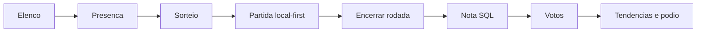
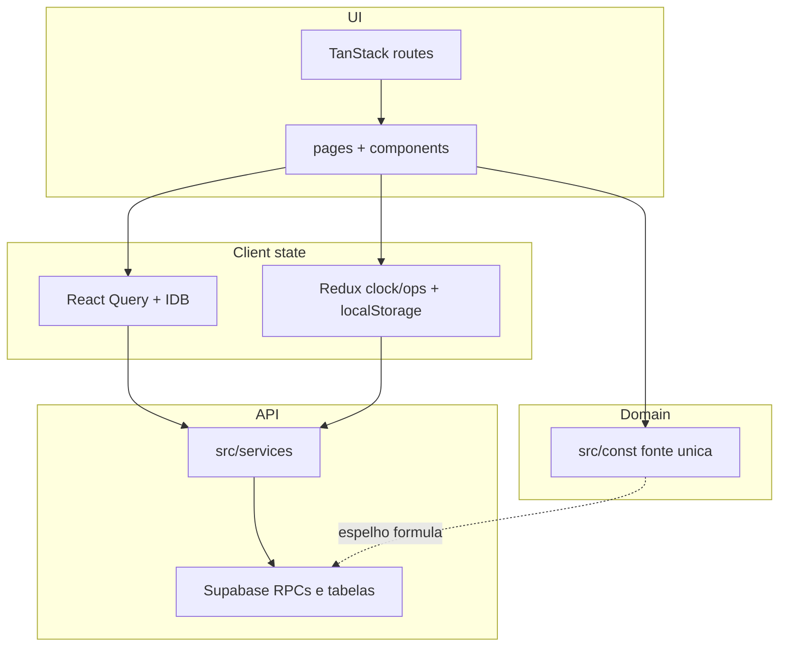
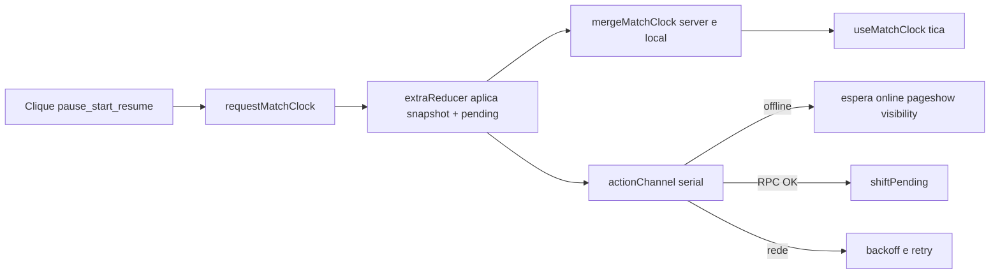
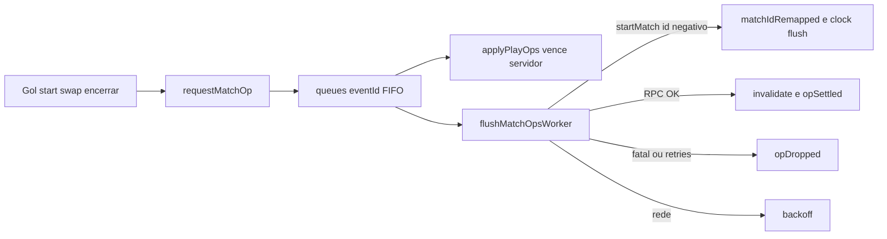
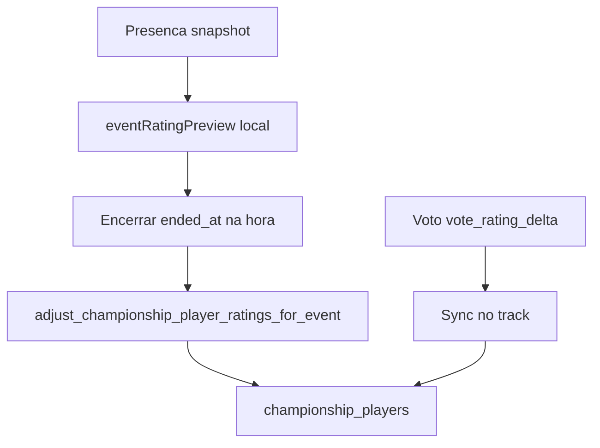
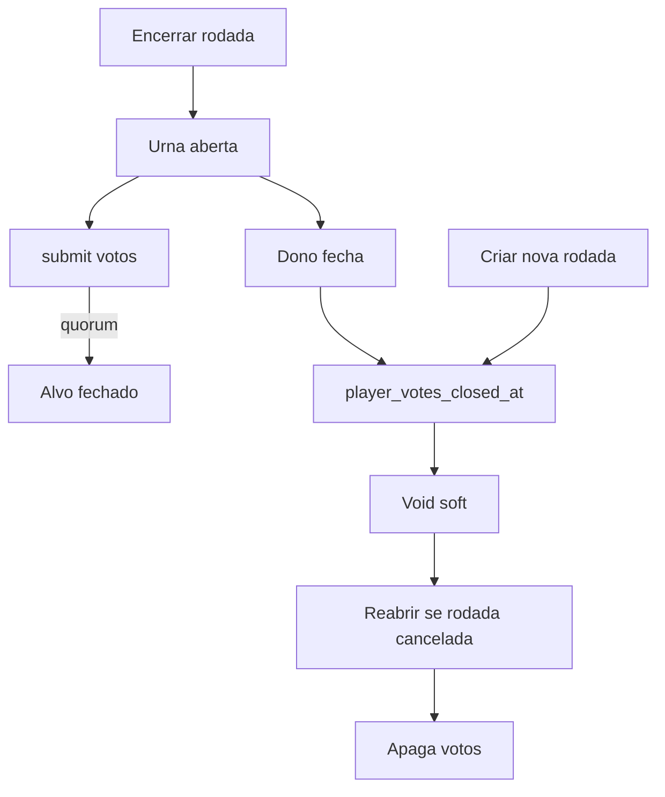
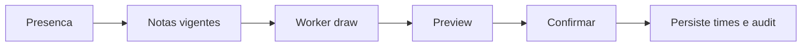

# Baba do Mago

PWA para pelada amadora: elenco, presença, sorteio por nota, partida ao vivo (local-first), nota pós-rodada, votos, pódio e tendências.

Tira o caos de WhatsApp + times no olho + placar na memória. No campo o celular passa de mão em mão — gol, troca e encerrar precisam funcionar offline ou com rede ruim.

Documento único para compartilhar (produto, arquitetura, fórmulas, filas, gráficos e motivos).

## Índice

1. [Ciclo do produto](#ciclo-do-produto)
2. [Stack](#stack)
3. [Setup](#setup)
4. [Auth Google](#auth-google-teste-local)
5. [Banco e rotas](#banco-migrations)
6. [Abas do campeonato](#abas-do-campeonato)
7. [Arquitetura](#arquitetura)
8. [Filas de partida](#filas-de-partida-clock--ops)
9. [Nota (rating)](#nota-rating-do-jogador)
10. [Voto do elenco](#voto-do-elenco)
11. [Sorteio](#sorteio-de-times)
12. [Nota oculta](#nota-oculta-hidden-strength)
13. [Gráficos e métricas](#gráficos-e-métricas-da-ui)

---

## Ciclo do produto



## Stack

| Camada | Escolha |
| --- | --- |
| App | React 19, TypeScript, Vite 7 |
| Rotas | TanStack Router |
| Server state | TanStack Query + persist IDB |
| Filas locais | Redux Toolkit + redux-saga + redux-persist |
| Backend | Supabase (Postgres, Auth Google, Realtime, Storage) |
| UI | Tailwind 4, Motion, Recharts |
| Package | **yarn** |
| Deploy | Vercel (SPA) + PWA |

**Princípio:** UI pinta na hora; fila só sincroniza.

## Setup

```bash
yarn
cp .env.example .env
yarn dev
```

Preencha no `.env`:

- `VITE_SUPABASE_URL`
- `VITE_SUPABASE_PUBLISHABLE_KEY`
- `VITE_MATCH_CLOCK_DEBUG` (opcional; filas em produção)

Não coloque `client_secret` do Google no front nem no `.env`. Client ID e Secret vão só no [Google provider do Dashboard](https://supabase.com/dashboard/project/sgbznwbgxrzrasrrvnuy/auth/providers?provider=Google).

Scripts: `yarn lint`, `yarn typecheck`, `yarn db:types` (gera `src/types/database.types.ts`).

## Auth Google (teste local)

Google Cloud → OAuth Web client:

- Authorized JavaScript origins: `http://localhost:5173` (com porta)
- Authorized redirect URIs: `https://sgbznwbgxrzrasrrvnuy.supabase.co/auth/v1/callback`

Supabase → Authentication → URL Configuration:

- Site URL: `http://localhost:5173`
- Redirect URLs: `http://localhost:5173/**`

## Banco (migrations)

Schema e RPCs em [`supabase/migrations/`](supabase/migrations/), ordem cronológica do timestamp no nome. Ambiente novo: aplicar **todas**. Conjunto atual passa de 100 arquivos. Types: `yarn db:types`.

## Rotas principais

| Rota | Uso |
| --- | --- |
| `/` | Campeonatos que você criou ou entrou |
| `/championships/new` | Criar (entra como jogador) |
| `/championships/:id` | Detalhe / abas |
| `/championships/:id/events/:eventId` | Rodada |
| `/championships/:id/events/:eventId/play` | Partida ao vivo |
| `/join/:codigo` | Convite público |

## Abas do campeonato

| Aba | Uso |
| --- | --- |
| Elenco | Jogadores, papéis, estrelas |
| Rodadas | Presença, sorteio, partida, encerrar |
| Classificação | Tabela agregada no cliente |
| Pódio | Rankings do período + share |
| Tendências | Forma, inflação, saúde, gols, heatmap… |
| Simular Sorteio | Prévia sem gravar |
| Projeções | Calibração / gap (dono) |
| Mensalistas | Quem é mensalista |
| Gestão | Config, votos void, auditoria |

Labels: `src/const/championship-tab.ts`.

---

## Arquitetura

### Camadas



| Camada | Papel |
| --- | --- |
| `src/pages` + `src/components` | Telas e UI |
| `src/const` | Fonte única de regras, labels PT, overlays, query keys |
| `src/hooks` | React Query + hooks de UI (clock, online, PWA) |
| `src/services` | Clientes finos Supabase |
| `src/store` | Só filas offline de partida (clock + ops) |
| `src/lib` | Query client, sorteio, share, auth guards |
| `src/workers` | Workers de sorteio equilibrado e potes |
| `supabase/migrations` | Schema, RPCs, RLS |

### Bootstrap

Ordem em `src/main.tsx`: Redux `Provider` → `PersistGate` → `AppQueryClientProvider` → Router.

### Estado

**React Query (servidor):** cache de campeonatos/elenco/rodadas/votos; IDB `baba-query-cache`; `networkMode: "offlineFirst"`; keys em `src/const/championships-query-key.ts`. Não escrever overlay de partida/nota no cache.

**Redux + Saga (filas):**

| Slice | Persist key | Whitelist |
| --- | --- | --- |
| `match-clock` | `babaDoMago-match-clock` | `clocks`, `deferredClear` |
| `match-ops` | `babaDoMago-match-ops-event` | `queues`, `seq`, `localMatchMap` |

Offline: `online` / `pageshow` / `visibility` (`online-channel.ts`).

**Context:** Auth Google, Theme. **Draft presença:** `baba-event-attendance-draft:{eventId}`.

### Pastas `src/`

| Pasta | Conteúdo |
| --- | --- |
| `routes/` | File-based TanStack Router |
| `pages/` | Páginas por rota |
| `components/` | Feature + atoms / molecules / organisms |
| `const/` | Domínio + `*.check.ts` |
| `store/match-clock` · `match-ops` | Slice, saga, flush-worker |
| `hooks/championships/` | Queries tipadas |
| `services/` | RPCs Supabase |
| `workers/` | Draw workers |
| `types/` | Inclui `database.types.ts` gerado |

### i18n e checks

Sem i18n lib — pt-BR via `*_LABEL` em `src/const/`. Checks `*.check.ts` ao lado da regra (asserts sem framework).

### Hierarquia de dados

```text
users → championships → championship_players
                      → championship_events
                          → attendance / rsvp / teams / matches / goals / votes
```

---

## Filas de partida (clock + ops)

Partida **local-first**: pause, gol, encerrar pintam na hora. Saga só sincroniza. Offline não apaga a fila.

Código: `src/const/championship-event-match.ts`, `championship-event-match-ops.ts`, `src/store/match-clock/`, `src/store/match-ops/`.

**Motivo:** no campo a rede falha; esperar RPC antes de pintar quebra o fluxo. Overlay local vence o servidor enquanto houver fila.

### Relógio (`match-clock`)



1. Clique → `requestMatchClock` → muda `started_at` / `paused_at` / `pause_accumulated_seconds` + empilha `pending`.
2. Display: `mergeMatchClock(server, local)`. Local vence com `hasMatchClockLocal`.
3. Tick só no snapshot mesclado; flush/offline/retry **não** param o tick.
4. Saga serial; offline espera rede sem tirar da fila.
5. `clearMatchClock` com `pending` → `deferredClear` até drain.
6. Ação inválida = no-op (pause duas vezes).

### Ops (`match-ops`)



Kinds: jogador, goleiro, gol, desfazer, abrir, editar time, trocar time, encerrar, descartar, presença, encerrar rodada.

1. Empilha em `queues[eventId]`; overlay vence refetch/realtime.
2. `startMatch` com `localId` negativo → remap + flush do clock.
3. Relógio não chama RPC com `matchId < 0`.
4. Fatal / retries esgotados → `opDropped`; rede → backoff.
5. Desfazer gol local cancela `addGoal` se ainda não `inFlightId`.
6. Encerrar/próxima/descarte no fim da fila; UI não espera.
7. Presença **antes** de `startMatch`; `endEvent` por último; nota final só no SQL.

### O que não fazer (filas)

- Não meter flush em `busy` / não `await` flush antes de pintar.
- Não trocar display pelo servidor enquanto houver snapshot local.
- Não limpar store com `pending` (usar `deferredClear`).
- Não escrever overlay no React Query.
- Não chamar RPC de relógio com id negativo.

Debug: botão da fila no `yarn dev`; produção `VITE_MATCH_CLOCK_DEBUG=true`.

---

## Nota (rating) do jogador

A nota **não é Elo**. Não depende de gols, adversário nem K-factor. Muda pelo **aproveitamento de pontos** da rodada.

### Motivação

1. Equilibrar times no sorteio de forma previsível.
2. Ignorar destaque individual (gol/assist) na força do time.
3. Empate justo: empates > derrotas → empate vale 1,5.
4. Escalar com o teto da liga (`max(maior nota, 5)`, até 100).

Duas métricas: `rating` (linha) e `goalkeeper_rating` (goleiro). Mesma fórmula TS + SQL.

### Conceitos

| Conceito | Significado |
| --- | --- |
| `rating` / `goalkeeper_rating` | Notas de linha e goleiro |
| Track vigente | `attendance.is_goalkeeper` escolhe qual nota ajusta |
| `0` (sentinela) | Sem nota oficial; no sorteio vira média dos presentes com nota |
| Teto / piso | ceiling da rodada; piso `0.1` (sentinela fica `0`) |
| MVP | `2%` da nota snapshot, ceil 1 casa, mín. `+0.1` |

Pontos: V=3, E=1 (ou **1,5** se E>D), D=0.

### Quando a nota não muda

- `matches < 3`
- Já ranqueado com aproveitamento na **zona morta** 45%–55% (MVP ainda pode somar)

### Fórmula (já ranqueado)

```text
drawPoints = draws > losses ? 1.5 : 1
points     = 3 * wins + drawPoints * draws
rate       = points / (3 * matches)
delta      = round((rate - 0.5) * ceiling / 2, 1)
notaNova   = clamp(notaAtual + delta, 0.1 … 100)
```

### Nota inicial (sentinela `0`)

Primeira rodada com 3+ jogos: semente **depois** delta ranqueado.

| Aproveitamento | Semente |
| --- | --- |
| < 45% | 2.7 |
| 45%–55% | 3 |
| > 55% | 3.5 |

Exceção: snapshot `0` + nota manual no elenco + `rating_delta = 0` → não reseeda.

### MVP

```text
bonus = max(0.1, ceil(rating * 0.02 * 10) / 10)
```

Até 3 MVPs/rodada. Sentinela ainda ganha `+0.1`.

### Exemplos (teto 5)

| Cenário | V/E/D/J | rate | Delta | De → Para |
| --- | --- | --- | --- | --- |
| Bom | 4/0/2/6 | 66,7% | +0,4 | 4 → **4,4** |
| Ruim | 1/0/2/3 | 33,3% | −0,4 | 3,5 → **3,1** |
| Zona morta | 2/0/2/4 | 50% | 0 | 4 → **4** |
| < 3 jogos | 1/0/0/1 | — | 0 | 4 → **4** |
| 3 empates (1,5) | 0/3/0/3 | 50% | 0 | 4 → **4** |
| Empates = derrotas | 0/2/2/4 | 16,7% | −0,8 | 4 → **3,2** |
| Semente boa | 4/0/2/6 | 66,7% | semente 3,5 +0,4 | 0 → **3,9** |

Mesmo rate, teto alto move mais (ex.: 66,7% com teto 75 → +6,3).

### Evolução pós-rodada



Nota do elenco **só no SQL**. Cliente não grava `championship_players.rating` no encerrar.

| Camada | Em `eventRatingDelta`? | Campo |
| --- | --- | --- |
| Aproveitamento / semente | sim | `rating_delta` |
| MVP | soma em cima | `rating_delta` |
| Amortecimento queda (flag) | só se delta &lt; 0 | `rating_delta` |
| Voto ±0,5 | não | `vote_rating_delta` |

### Amortecimento de queda (flag)

`rating_drop_goal_share` (default off). Só delta negativo; share G+A no próprio time **> 40%** → `delta *= (1 − share)`. `rating_drop_share_exclude_top`: top 10 da liga não entram. Gol **não** sobe nota.

### Código da nota

| Camada | Onde |
| --- | --- |
| TS | `src/const/event-rating-adjustment.ts` |
| Checks | `event-rating-adjustment.check.ts` |
| SQL | `championship_event_rating_delta`, `adjust_championship_player_ratings_for_event` |
| Simulador ficha | `?tab=sim` — não grava |

**SQL e TS iguais.** Não inventar Elo, K-factor, ajuste por adversário ou gols na fórmula base.

---

## Voto do elenco

Overlay ±0,5 **depois** da rodada. Não entra em `eventRatingDelta`. Urna secreta; dono vê totais. Código: `src/const/event-player-vote.ts`.

**Motivo:** fórmula é cega a “foi decisivo”; elenco ajusta fino sem virar Elo social.

**Quem vota:** dono/capitão/admin presentes, ou mensalista (mesmo ausente). Flag `player_vote_allow_self`. Só com `ended_at`.

| Item | Valor |
| --- | --- |
| Quórum | `player_vote_quorum` (default 3, 1–10) |
| Orçamento | 5 likes + 5 dislikes; manter/nulo ilimitados |
| Like / dislike | N+ e supera o outro polo **e** maintains → ±0,5 e fecha |
| Manter | bloqueia ±0,5 se não superado |
| Nulo (`blank`) | grava urna; fora da fórmula |
| Totais | só dono |



Encerrar rodada ≠ encerrar votação. Void soft: notas voltam, votos ficam. Reabrir apaga votos (não reativa efeito antigo). Sentinela guarda overlay até semente.

RPCs: `submit_…`, `list_…_vote_counts`, `close_…`, `void_…`, `reopen_…`.

---

## Sorteio de times

Roda no **cliente** (worker). Banco só persiste resultado + auditoria.

**Motivo:** times no olho viram briga; worker não trava a UI.

| Modo | O que faz | Quando |
| --- | --- | --- |
| Equilibrado | Minimiza spread de rating | Fluxo principal |
| Potes | Cabeças + potes | Paralelo; não substitui |
| Simulador | Prévia sem gravar | Aba Simular Sorteio |

- Track: goleiro voluntário → `goalkeeper_rating`; senão `rating`.
- Sentinela `0` → média dos presentes com nota.
- Seed: empates/auditoria/replay — não “melhora” equilíbrio.



Libs: `src/lib/event-team-draw.ts`, `event-team-pot-draw.ts`. Workers em `src/workers/`.

---

## Nota oculta (hidden strength)

Paralela à pública. Não substitui `rating`. Só **dono**. Código: `src/const/hidden-strength.ts`. Migration `20260906160000_hidden_strength.sql`.

**Motivo:** calibrar favorito/projeções sem poluir o elenco.

| É | Não é |
| --- | --- |
| Walk por eventos encerrados | Elo |
| Tracks line / goalkeeper | Nota do sorteio público |
| Favorito oculto / calibração | Visível ao elenco |

Sem oculta: rescale da pública + deltas. Usos: equilíbrio oculto no pódio, calibração do favorito, gap pública × oculta (estrela desalinhada).

---

## Gráficos e métricas da UI

Agregações no **cliente**. Filtros: janela (`TRENDS_WINDOW`) e audiência todos/mensalistas.

### Tendências

| Gráfico | Métrica | Motivo | Limite |
| --- | --- | --- | --- |
| Presença no tempo | Presentes; % / elenco ativo | Enche ou esvazia? | Não mede qualidade |
| Inflação da nota | Média / teto / piso por rodada | Explicar “todo mundo subiu” | Clima da liga, não mérito |
| Evolução da nota | Nota no recorte | Quem subiu/desceu | Recorte curto mente |
| Forma recente | Aproveitamento, Δ, voto | Hot/cold | Zona morta ≠ queda |
| Ranking goleiros | V/E/D, sofridos, clean sheets | Track goleiro | WinRate ≠ aproveitamento nota |
| Consistência × volume | Jogos × desvio-padrão | Estável vs irregular | Desvio ≠ pior; ≥3 presenças |
| Saúde da rodada | Partidas, gols/jogo, minutos clock, spread, apertados | Diagnóstico operacional | Minutos = cronômetro |
| Gols da rodada | Total por rodada | Complementa saúde | Sem mérito individual |
| Timeline de gols | Histograma minuto; abertura×virada | Quando o jogo explode | Precisa cobertura de minuto |
| Heatmap de forma | Aproveitamento por célula (≤20) | Share rápido | Cap 20 |

### Pódio

Rankings do período (gols, assists, MVP, evolução, viradas, “mais servido”…), sinergia de duplas, equilíbrio público/oculto, share imagem/CSV/GIF corrida da nota.

**Limite:** filtro mensalistas muda ranking; previsto ≠ placar; recap não reaplica delta.

### Classificação

Agregação só no cliente. Não é “oficial FIFA”; depende do cache.

### Projeções (dono)

| | Calibração do favorito | Gap pública × oculta |
| --- | --- | --- |
| **Métrica** | Favorito venceu por faixa de spread | Oculta vs rescale |
| **Motivo** | Validar se a nota prevê | Achar estrela errada |
| **Limite** | **Não** é prob. de vitória futura (times mudam) | Não altera sorteio sozinho |

### Scatter / ficha

Rating scatter (inicial×atual), gols×assists, histórico na ficha, corrida GIF/vídeo (mídia, não canônico).

### O que o produto não mostra de propósito

- Probabilidade de vitória entre times fixos
- Elo / K-factor / ajuste por adversário na fórmula base
- Oculta para o elenco inteiro

---

## Domínio em uma frase

- **Nota** = aproveitamento de pontos (não Elo)
- **Duas notas** = linha e goleiro
- **Partida** = overlay + FIFO Redux; SQL depois
- **Sorteio** = worker no cliente
- **Voto** = overlay ±0,5 com quórum
- **Oculta** = só dono; projeções/favorito
